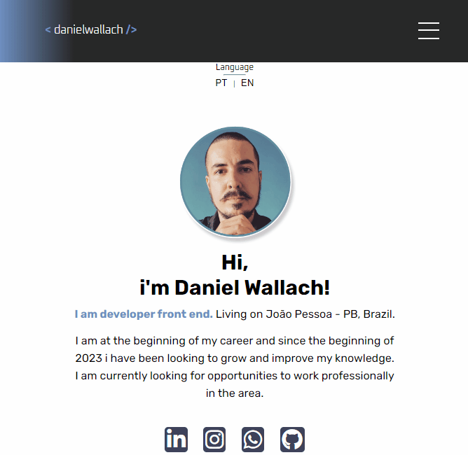
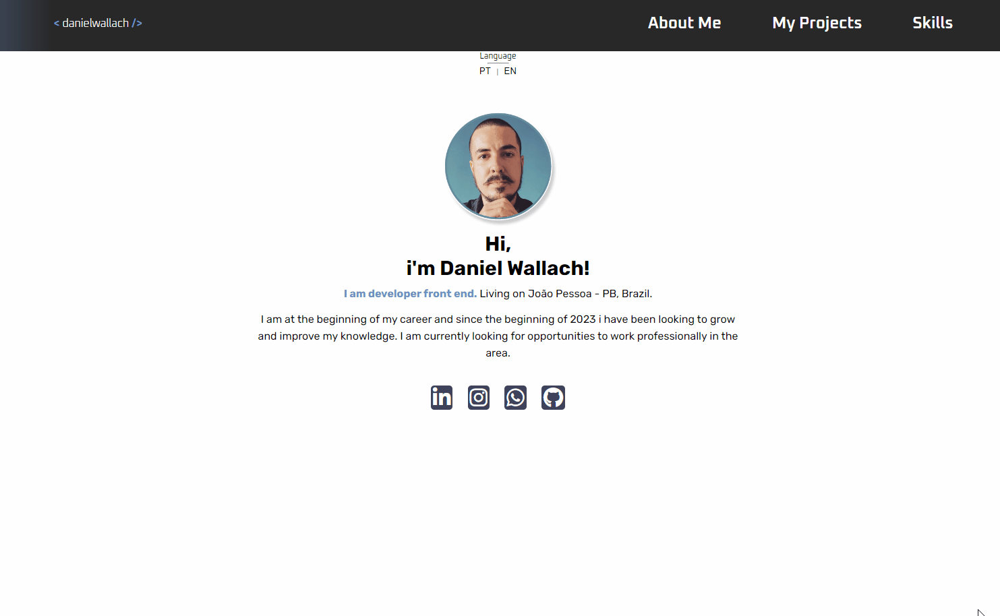
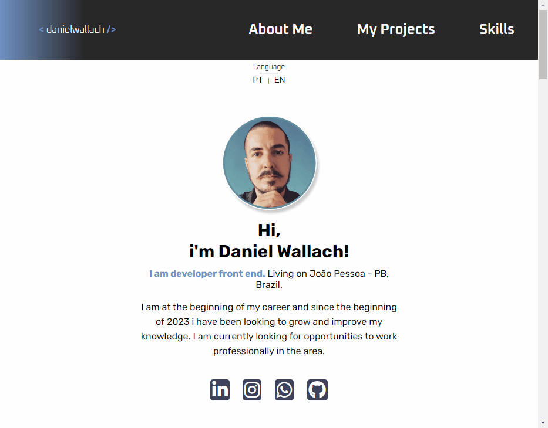
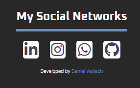
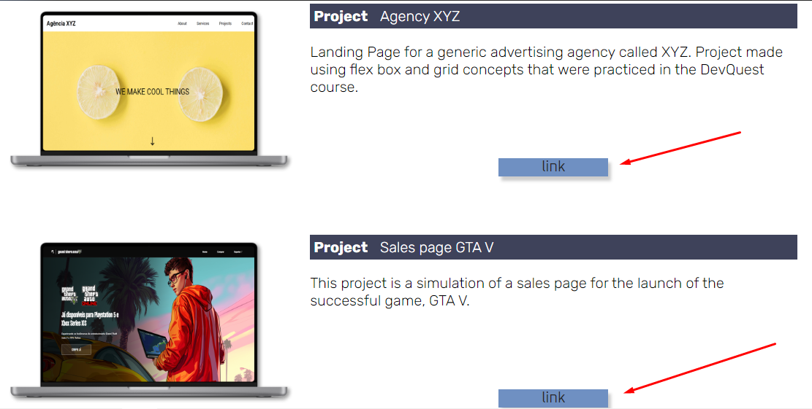

<h1 align="center"> My Portfolio</h1>

 
 

## ⚪Índice 
* [DESCRIÇÃO](#descrição)
* [FUNCIONALIDADES](#funcionalidades)
* [TECNOLOGIAS UTILIZADAS](#tecnologias-utilizadas)
* [LINK DO PROJETO](#link-do-projeto)
* [AUTOR](#autor)

 
 

## ⚪Descrição 
Esse é um projeto do meu portfólio profissional como desenvolvedor frontend.

Além da necessidade de criar meu proprio portfólio colocando a mão na massa, o mesmo projeto teve a motivação de um desafio proposto no curso do qual sou aluno, o DevQuest, ministrado pelos gêmeos Ricardo e Roberto do Dev em Dobro.

O projeto basicamente além de mostrar um pouco sobre minha pessoa e gostos pessoas, trás informações a parte profissional, mostrando minhas habilidades, o que eu busco, alguns projetos que desenvolvi, informações de contato e minhas redes sociais.

 
 

## ⚪Funcionalidades
⭐ O projeto possui um visual mais claro, tendo a linguagem padrão inglês, mas com a opção mudar a língua para português.

 
 

⭐ O HEADER possui um menu com as opções de navegação ABOUT ME, MY PROJECTS e SKILLS.

Clicando em alguma opção, o scroll vai automaticamente para a seção desejada deixando sempre a barra de menu fixa e visível durante a navegação.

 
 

⭐ Além de toda a página, o menu também está responsivo de modo que cria-se um menu hambúrguer recolhível para telas menores.

 
 

⭐ Os links das minhas redes sociais podem ser acessadas tanto na section HOME, quanto no FOOTER.

 
 

⭐ Na sessão Meus Projetos, dá pra acessar o link e ver os projetos.

 
 

## ⚪Tecnologias utilizadas

 
 

## ⚪Link do projeto

 

 
 

## ⚪Autor

<a href="https://github.com/danielwallach">
 
  
 <b>Daniel Wallach</b></a> <a href="https://github.com/danielwallach" >👽</a>

Feito com ❤️ por Daniel Wallach

 
 
 

